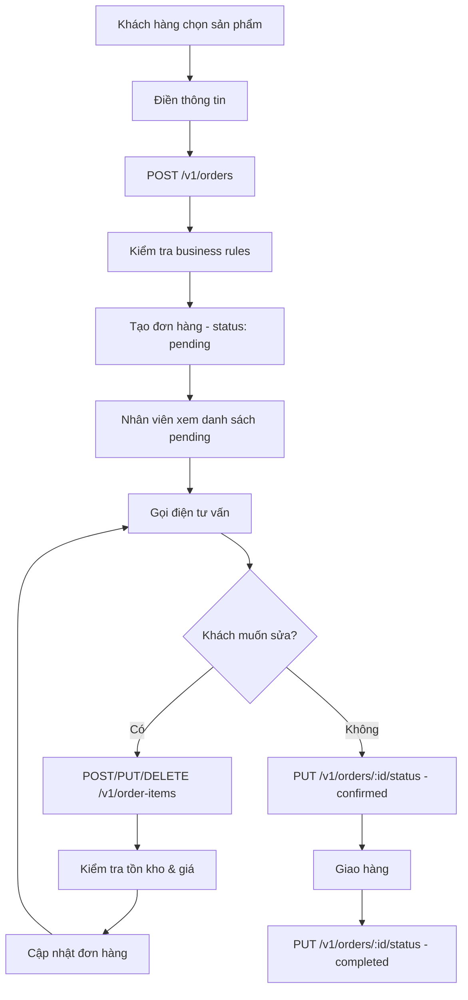

# Order Module - API Documentation

Module quản lý đơn hàng với hệ thống đơn giản: khách hàng chọn sản phẩm → điền thông tin → đặt hàng → nhân viên gọi điện xác nhận.

## 🚀 API Endpoints

### 1. **Tạo Đơn Hàng** (Public)
```http
POST /v1/orders
Content-Type: application/json

{
  "customer_name": "Nguyễn Văn A",
  "customer_phone": "0123456789",
  "customer_email": "nguyenvana@email.com",
  "shipping_address": "123 Đường ABC, Quận 1, TP.HCM",
  "notes": "Giao hàng vào buổi chiều",
  "order_items": [
    {
      "product_id": 1,
      "quantity": 2
    }
  ]
}
```

**Response:**
```json
{
  "status": "success",
  "message": "Order created successfully",
  "data": {
    "id": 1,
    "order_number": "ORD20241201120000",
    "status": "pending",
    "total_amount": 500000,
    "customer_name": "Nguyễn Văn A",
    "customer_phone": "0123456789",
    "customer_email": "nguyenvana@email.com",
    "shipping_address": "123 Đường ABC, Quận 1, TP.HCM",
    "notes": "Giao hàng vào buổi chiều",
    "created_at": "2024-12-01T12:00:00Z"
  }
}
```

### 2. **Lấy Danh Sách Đơn Hàng** (Admin Only)
```http
GET /v1/orders?status=pending
Authorization: Bearer <token>
```

**Query Parameters:**
- `status`: pending, confirmed, completed, cancelled
- `processed_by`: ID nhân viên xử lý
- `customer_phone`: Số điện thoại khách hàng
- `order_number`: Mã đơn hàng

### 3. **Lấy Chi Tiết Đơn Hàng** (Admin Only)
```http
GET /v1/orders/1
Authorization: Bearer <token>
```

### 4. **Lấy Đơn Hàng Theo Mã** (Public)
```http
GET /v1/orders/number/ORD20241201120000
```

### 5. **Cập Nhật Đơn Hàng** (Admin Only)
```http
PUT /v1/orders/1
Authorization: Bearer <token>
Content-Type: application/json

{
  "customer_name": "Nguyễn Văn B",
  "customer_phone": "0987654321",
  "shipping_address": "456 Đường XYZ, Quận 2, TP.HCM",
  "notes": "Giao hàng vào buổi sáng"
}
```

### 6. **Cập Nhật Trạng Thái Đơn Hàng** (Admin Only)
```http
PUT /v1/orders/1/status
Authorization: Bearer <token>
Content-Type: application/json

{
  "status": "confirmed",
  "processed_by": 1
}
```

## 🛒 **Order Item APIs** (Admin Only)

### 7. **Thêm Sản Phẩm Vào Đơn Hàng**
```http
POST /v1/orders/1/items
Authorization: Bearer <token>
Content-Type: application/json

{
  "product_id": 2,
  "quantity": 1
}
```

### 8. **Lấy Danh Sách Sản Phẩm Trong Đơn Hàng**
```http
GET /v1/orders/1/items
Authorization: Bearer <token>
```

### 9. **Lấy Chi Tiết Sản Phẩm Trong Đơn Hàng**
```http
GET /v1/order-items/1
Authorization: Bearer <token>
```

### 10. **Cập Nhật Sản Phẩm Trong Đơn Hàng**
```http
PUT /v1/order-items/1
Authorization: Bearer <token>
Content-Type: application/json

{
  "quantity": 3
}
```

### 11. **Cập Nhật Số Lượng Sản Phẩm**
```http
PUT /v1/order-items/1/quantity
Authorization: Bearer <token>
Content-Type: application/json

{
  "quantity": 2
}
```

### 12. **Xóa Sản Phẩm Khỏi Đơn Hàng**
```http
DELETE /v1/order-items/1
Authorization: Bearer <token>
```

## 📋 Business Rules

### **Tạo Đơn Hàng**
1. ✅ **Thông tin bắt buộc**: Tên, số điện thoại, địa chỉ giao hàng
2. ✅ **Kiểm tra sản phẩm**: Sản phẩm phải tồn tại
3. ✅ **Kiểm tra tồn kho**: Số lượng đặt phải ≤ tồn kho
4. ✅ **Tính giá tự động**: Sử dụng giá hiện tại của sản phẩm
5. ✅ **Tạo mã đơn hàng**: Format `ORD + timestamp`

### **Cập Nhật Trạng Thái**
1. ✅ **Chuyển trạng thái hợp lệ**:
   - `pending` → `confirmed` hoặc `cancelled`
   - `confirmed` → `completed` hoặc `cancelled`
   - `completed` và `cancelled` → Không thể chuyển
2. ✅ **Nhân viên xử lý**: Phải là admin
3. ✅ **Tự động cập nhật thời gian**: `processed_at`, `completed_at`

### **Quản Lý Order Item**
1. ✅ **Chỉ sửa được khi đơn hàng pending**: Không thể sửa khi đã confirmed/completed
2. ✅ **Kiểm tra tồn kho**: Số lượng đặt phải ≤ tồn kho
3. ✅ **Giá tự động**: Luôn sử dụng giá hiện tại của sản phẩm
4. ✅ **Merge sản phẩm**: Nếu sản phẩm đã có trong đơn hàng, tăng số lượng
5. ✅ **Validation**: Số lượng phải > 0

### **Validation**
1. ✅ **Số điện thoại**: Tối thiểu 10 ký tự
2. ✅ **Số lượng**: Phải > 0
3. ✅ **Giá sản phẩm**: Phải > 0
4. ✅ **Tổng tiền**: Phải > 0

## 🔄 Flow Đặt Hàng



## 🛡️ Security

- **Public APIs**: Tạo đơn hàng, xem đơn hàng theo mã
- **Admin APIs**: Tất cả API khác cần JWT token
- **Role-based**: Chỉ admin mới được xử lý đơn hàng

## 📊 Response Format

```json
{
  "status": "success|error",
  "message": "Human readable message",
  "data": {}, // Response data
  "error": "Error details", // Only when status = error
  "paging": { // Only for list endpoints
    "page": 1,
    "limit": 10,
    "total": 100
  }
}
```

## 🚨 Error Codes

- `ErrCustomerNameRequired`: Tên khách hàng bắt buộc
- `ErrCustomerPhoneRequired`: Số điện thoại bắt buộc
- `ErrShippingAddressRequired`: Địa chỉ giao hàng bắt buộc
- `ErrOrderItemsRequired`: Danh sách sản phẩm bắt buộc
- `ErrProductNotFound`: Sản phẩm không tồn tại
- `ErrInsufficientStock`: Không đủ tồn kho
- `ErrInvalidStatusTransition`: Chuyển trạng thái không hợp lệ
- `ErrInvalidProcessor`: Nhân viên xử lý không hợp lệ

## 🧪 Testing

Sử dụng Swagger UI để test: `http://localhost:3000/swagger/index.html`
